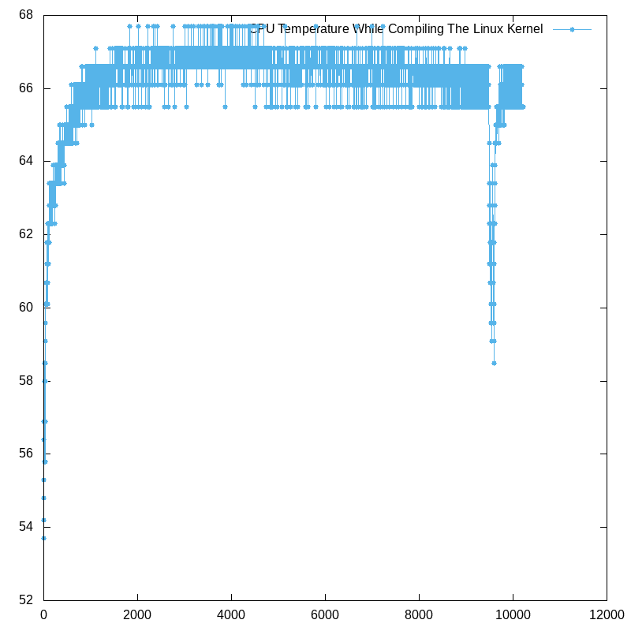

# Performance Report

## Introduction
Temperature can be a critical factor when it comes to performance of IoT devices, and computers in general. If power, hardware, and program efficiency can be guarenteed, temperature remains one variable that will always have the potential for impact on a device. Temperature can cause dangerous crashes, leading to corruption of files and other important data, as well as performance issues in less severe cases. This report will examine the temperatureof the ARM cores of the Raspberry Pi while it was undergoing compilation of the Linux Kernel.

## Analysis
Temperature is a primary concern for the performance of the Raspberry Pi. If the Pi begins to overheat, throttling may occur to reduce the temperature, or there is even a potential that the Pi itself could crash due to heat related hardware issues.

As this graph above shows, the CPU rapidly heats up before it plateaus around 67'Celsius for the duration of the compilation process. While this is higher then the average idle temperature of the core, it's not at a critical point where performance is affected (normally over 70'Celsius [1]). To ensure best performance, make sure the pi is properly ventilated as to ensure that overheating is not an issue.

## Conclusion
In conclusion, it can be said that performance was not at a point where it could suffer greatly, but if neglagent with caring for the Raspberry Pi's temperature, there could be significant impacts present.

## References
[1]B. Hale, "Safe CPU Temps: How Hot Should My CPU Be? (Idle & Under Load)", *Tech Guided*, 2019. [Online]. Available: https://techguided.com/safe-cpu-temp/. [Accessed: 12-Oct-2020]
